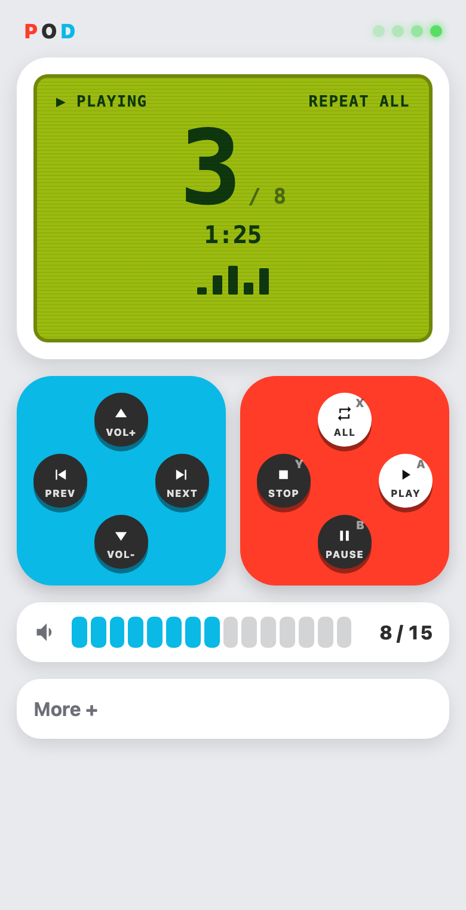
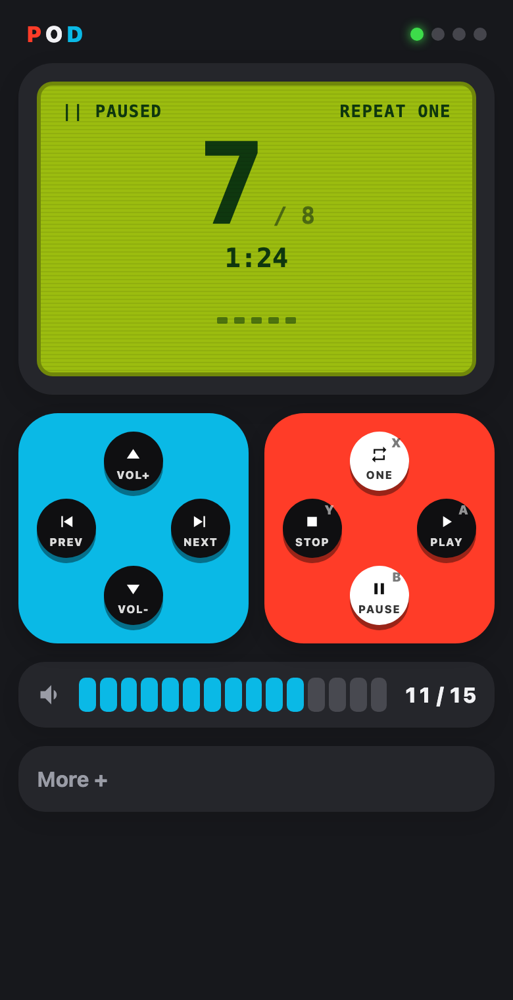
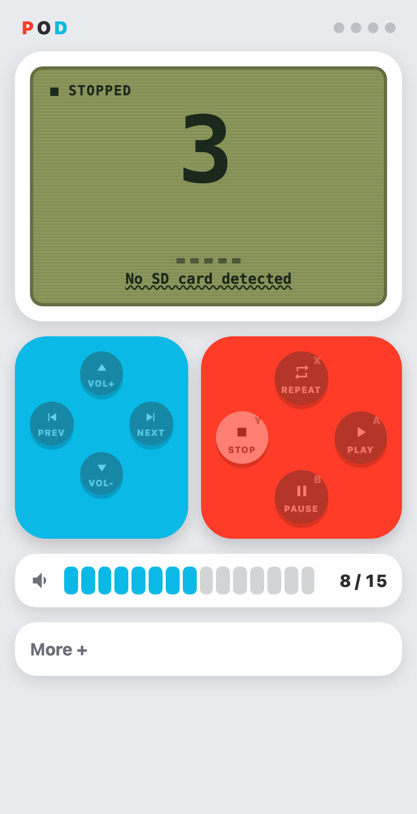
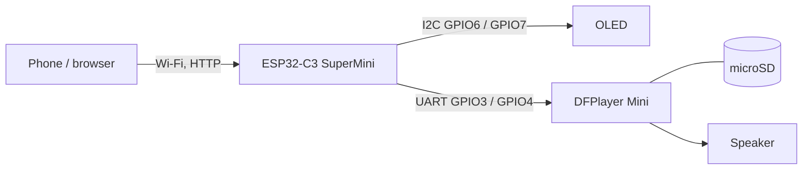

# Pod Player

A small Wi-Fi MP3 player: an **ESP32-C3 SuperMini** drives a **DFPlayer Mini**, shows what is playing on a
**0.96" OLED**, and serves a control page you open on your phone. The page is styled after a Switch
Joy-Con with a Game Boy style LCD.

<p align="center">
  
  
  
</p>

*The screenshots are the real page from `player/web_page.h`, rendered in Chrome at phone size against a
simulated player (`tools/ui/`). They are not photos of the finished device.*

## Features

- **Controls:** play, pause, stop, next, previous, volume, repeat (off / all / one), jump to a track.
  Next and previous always start the neighbouring track and wrap at the ends.
- **OLED:** play state, repeat mode, track number and count, estimated elapsed time, volume, and the
  network address.
- **Web page:** works on any phone or computer on the same network, no app and nothing loaded from the
  internet. Dark mode, keyboard shortcuts (space, arrows, `S`, `R`), hold the D-pad to repeat volume,
  clear messages when there is no module, card or track.
- **Wi-Fi setup on the phone:** the player opens a setup hotspot, you pick your network and type the
  password. By default nothing is remembered, so the setup runs at every start (see `WIFI_MEMORY`).
- **Built for flaky DFPlayer clones:** commands are queued and spaced out, a track change stops first,
  missing files are skipped, the volume is sent again after the module settles, and there is a module
  reset button.
- **Reliability:** watchdog, Wi-Fi reconnect, non-blocking logging, `/api/health` with reset reasons and
  counters. Actions are POST-only and need a header, so another website cannot press your buttons.

## Hardware

| Part | Notes |
|---|---|
| ESP32-C3 SuperMini | The brain. Powered over USB-C. |
| DFPlayer Mini (MP3-TF-16P V3.0, YX5200 type) | Reads the microSD card and decodes MP3. |
| microSD card | FAT32. |
| 0.96" SSD1306 OLED, 128x64, I2C | Status display. |
| 8 ohm speaker | On the DFPlayer's SPK1 and SPK2. A 0.5 W speaker is easy to overdrive. |
| 1 kohm resistor (optional) | In the ESP32 TX to DFPlayer RX wire; reduces clicks. |



| DFPlayer Mini | ESP32-C3 SuperMini |
|---|---|
| VCC | 3.3 V |
| GND | GND |
| TX | GPIO3 (ESP32 RX) |
| RX | GPIO4 (ESP32 TX), through 1 kohm if you have one |
| SPK1, SPK2 | the two speaker terminals (neither goes to ground) |

| OLED | ESP32-C3 SuperMini |
|---|---|
| VCC | 3.3 V |
| GND | GND |
| SDA | GPIO6 |
| SCL | GPIO7 |

Pins can be changed in `player/config.h`. GPIO2, 8 and 9 are strapping pins on this board and are avoided.

**Power and volume.** On 3.3 V the DFPlayer's amplifier is limited, so the volume tops out low and the
firmware caps it at 15 of 30 (`VOLUME_MAX`) to protect a small speaker. For more volume, feed the
DFPlayer from a 5 V pin or a LiPo rail (3.7 to 4.2 V) and put a 100 uF capacitor across its supply pins.

## Build and flash

Needs [arduino-cli](https://arduino.github.io/arduino-cli/).

```sh
arduino-cli core install esp32:esp32 \
  --additional-urls https://espressif.github.io/arduino-esp32/package_esp32_index.json
arduino-cli lib install U8g2 WiFiManager

arduino-cli board list          # find the port, e.g. /dev/cu.usbmodem14201
arduino-cli compile --fqbn esp32:esp32:esp32c3:CDCOnBoot=cdc player
arduino-cli upload  -p /dev/cu.usbmodem14201 --fqbn esp32:esp32:esp32c3:CDCOnBoot=cdc player
```

Tested with ESP32 core 3.3.12, U8g2 2.36.19 and WiFiManager 2.0.17. If the board does not show up as a
port, hold its BOOT button while plugging it in. The firmware uses about 92% of the default app
partition.

## Prepare the SD card

The module plays the **Nth file on the card, in the order the files were written**, so file names do not
matter but copy order does. It counts every file it finds, so keep only your tracks on the card.

1. Format the card as FAT32 (a fresh card keeps the order predictable).
2. Copy the songs one at a time, in the order you want, without macOS's hidden copies:
   ```sh
   cd ~/Music/my-songs
   for f in *.mp3; do COPYFILE_DISABLE=1 cp "$f" /Volumes/YOURCARD/mp3/; sync; done
   dot_clean /Volumes/YOURCARD
   ```
3. Files must be 16-bit PCM MP3 at 22.05, 44.1 or 48 kHz; other rates are skipped by the chip.

If an existing card plays in the wrong order, a tool such as `fatsort` can re-sort it in place. The player
cannot show song titles, because the module only reports track numbers.

## First run

1. Power the player. The OLED shows **Join Wi-Fi: thepod-player** and a password (`pod-` plus six
   characters, unique to your board).
2. On your phone, join that hotspot. The setup page opens by itself; if not, go to `192.168.4.1`.
3. Choose your Wi-Fi network, enter its password, save.
4. The OLED then shows the player's address. Open it, or go to `http://thepod.local`.

With the default `WIFI_MEMORY 2` the network is forgotten at every start, so repeat this after every
power-up. Set it to `0` to remember the network, or `1` to forget it only at power-up. If nobody sets up
Wi-Fi within five minutes the player falls back to its own hotspot, and the control page is at
`192.168.4.1`.

## Configuration

Everything is in `player/config.h`. The ones you are most likely to change:

| Setting | Default | What it does |
|---|---|---|
| `VOLUME_MAX`, `VOLUME_DEFAULT` | 15, 8 | Volume ceiling and start value (module range is 0 to 30). |
| `WIFI_MEMORY` | 2 | 0 remember the network, 1 forget at power-up, 2 forget at every start. |
| `PLAY_BY_INDEX` | 1 | 1 plays by position (any file names), 0 needs `/mp3/0001.mp3`, `0002.mp3`, and so on. |
| `TRACK_COUNT_OVERRIDE` | 0 | 0 asks the module for the file count; set the real number if it miscounts. |
| `DFPLAYER_*_PIN`, `OLED_*_PIN` | 3, 4, 6, 7 | Wiring. |
| `AP_PASSWORD` | empty | Empty derives a per-device hotspot password; 8 or more characters override it. |
| `LOG_LEVEL` | 1 | 0 off, 1 events, 2 also every DFPlayer frame. |
| `DF_CMD_GAP_MS` | 120 | Minimum gap between frames to the module; raise it if commands get dropped. |

## HTTP API

Reads are plain `GET`. Actions are `POST` and must send the header `X-Pod: 1`; otherwise they get 403.

| Route | Does |
|---|---|
| `GET /api/status` | State, track, count, volume, repeat, link status, elapsed seconds, address. |
| `GET /api/health` | Uptime, free memory, signal, last reset reason, counters. |
| `POST /api/play`, `/api/pause`, `/api/stop`, `/api/toggle` | Transport. |
| `POST /api/next`, `/api/prev` | Start the next or previous track (wraps). |
| `POST /api/track?n=5` | Start track 5. |
| `POST /api/volume?v=8` | Set the volume (clamped to `VOLUME_MAX`). |
| `POST /api/repeat[?mode=off\|all\|one]` | Set or cycle repeat. |
| `POST /api/rescan`, `/api/reset-module` | Re-read the card; reset the DFPlayer. |
| `POST /api/wifi-reset` | Restart into Wi-Fi setup. |

```sh
curl -X POST -H "X-Pod: 1" http://thepod.local/api/next
curl http://thepod.local/api/status
```

Bad input gets HTTP 400, a refused or too-fast request gets 409 or 429, and none of them send anything to
the module.

## Testing

- **On the device:** build with `--build-property "compiler.cpp.extra_flags=-DLOG_LEVEL=2"`, flash, put the
  computer on the same network as the player and connect it by USB, then run
  `python3 tools/test_controls.py http://<player-address>`. It presses every control through the API and
  checks the exact frames the board sends to the DFPlayer, the reported state, input refusal, the rate limit
  and frame spacing. Audio plays while it runs.
- **The web page, without hardware:** `python3 tools/ui/mock_player.py` serves the real page against a
  simulated player, and `node tools/ui/ui_test.mjs` drives it in headless Chrome (macOS Chrome path) and
  checks 36 behaviours. `node tools/ui/screenshots.mjs` regenerates the images above.

## Troubleshooting

| Symptom | Likely cause and fix |
|---|---|
| "No SD card detected" | Card not seated, not FAT32, or the module just started; try **Rescan card** or **Reset module** in the More panel. |
| "Track file not found" | With `PLAY_BY_INDEX 0` the files need four-digit names in `/mp3`. The default plays by position. |
| Count is double what you expect | macOS added hidden `._*` copies. Run `dot_clean` on the card. |
| Wrong play order | Order is the copy order; recopy one by one or re-sort with `fatsort`. |
| Quiet, or clicks and resets at volume | The DFPlayer on 3.3 V cannot supply the speaker's current; see "Power and volume". |
| Never reaches the network | Use a 2.4 GHz network (the ESP32-C3 has no 5 GHz). Some SuperMini boards connect better at lower transmit power, which is on by default (`LOWER_WIFI_TX_POWER`). |
| Asks for Wi-Fi every start | That is `WIFI_MEMORY 2`; set it to 0 or 1. |
| Phone says authentication failed on the setup hotspot | Forget the old saved `thepod-player` network on the phone and use the password shown on the OLED. |

## Layout

```
player/                 firmware: player.ino, config.h, web_page.h
tools/test_controls.py  end-to-end control test against the real device
tools/ui/               simulated player, browser test and screenshot script
docs/design-decisions.md  design, guardrails and operation notes
docs/images/            README screenshots
```

## Related projects

Other builds with the same parts, whose lessons shaped parts of this one:
[DIYPOD Shuffle](https://github.com/CortexFirmware/diypod) (ESP32-C3 SuperMini, DFPlayer, SSD1306, buttons),
[esp32_dfplayer](https://github.com/altJSV/esp32_dfplayer) (web control for ESP32) and
[roberttidey/dfPlayer](https://github.com/roberttidey/dfPlayer) (ESP8266, WiFiManager, browser UI).

## Notes

The styling is inspired by Nintendo hardware. This project is not affiliated with or endorsed by
Nintendo; Nintendo, Switch, Joy-Con and Game Boy are trademarks of Nintendo. No license has been chosen
for this project yet.
